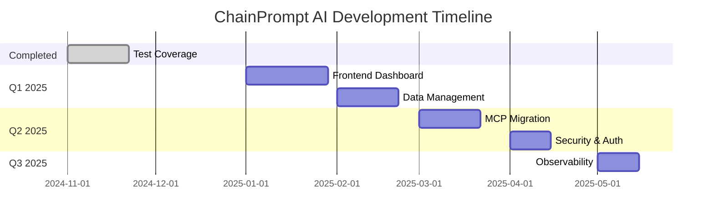

# 🗺️ ChainPrompt AI - Roadmap

## ✅ Milestone 1: Test Coverage & Quality (COMPLETATA)
**Obiettivo**: Raggiungere 80% di test coverage sul backend  
**Status**: ✅ Completata (83.54% backend, 85.77% totale)  
**Data completamento**: 22 Novembre 2024

### Risultati
- ✅ Test coverage backend: **83.54%** (esclusi tools/utils destinati a MCP)
- ✅ Test coverage totale: **85.77%** (backend + core)
- ✅ 27 test suite, 172 test totali passanti
- ✅ Coverage per componenti:
  - Controllers: 99%
  - MongoDB Services: 94%
  - PostgreSQL Services: 82%
  - Database Clients: 100%
  - Error Handler: 100%

### Deliverables
- [x] Test suite completi per MongoDB services
- [x] Test suite completi per PostgreSQL services
- [x] Test per database clients (MongoDB, Redis)
- [x] Test per error handler middleware
- [x] Script `testcoverage.sh` con esclusione tools/utils
- [x] Documentazione coverage in `docs/testing/coverage-results.md`

---

## 🚀 Milestone 2: Frontend Dashboard
**Obiettivo**: Creare una dashboard web per gestire e monitorare il sistema  
**Status**: 📋 Pianificata  
**Priorità**: Alta  
**Stima**: 3-4 settimane

### Obiettivi
- [ ] Setup progetto frontend (React/Next.js + TypeScript)
- [ ] Configurazione Docker Compose separato per frontend
- [ ] Integrazione con API backend esistenti
- [ ] Implementazione UI/UX moderna e responsive

### Features Principali
- [ ] **Dashboard Overview**
  - Statistiche utilizzo agenti
  - Metriche conversazioni
  - Health check servizi (MongoDB, Redis, PostgreSQL)
  
- [ ] **Gestione Agenti**
  - Lista agenti configurati
  - CRUD agenti (integrazione con `/config/agents`)
  - Visualizzazione configurazioni e prompt
  - Test agenti in tempo reale

- [ ] **Gestione Configurazioni**
  - CRUD configurazioni sistema
  - Gestione prompt frameworks
  - Configurazione tool registry

- [ ] **Monitoring & Logs**
  - Visualizzazione logs in tempo reale
  - Metriche performance
  - Error tracking

### Stack Tecnologico Proposto
- **Framework**: Next.js 14+ (App Router)
- **UI Library**: shadcn/ui + Tailwind CSS
- **State Management**: Zustand o React Query
- **Charts**: Recharts o Chart.js
- **Containerization**: Docker + Docker Compose
- **API Integration**: Axios/Fetch con TypeScript

### Deliverables
- [ ] Progetto frontend inizializzato
- [ ] Docker Compose configurato
- [ ] Dashboard principale implementata
- [ ] Integrazione API backend
- [ ] Documentazione deployment

---

## 🗄️ Milestone 3: Data Management & Persistence
**Obiettivo**: Implementare gestione avanzata dei dati persistiti  
**Status**: 📋 Pianificata  
**Priorità**: Media-Alta  
**Stima**: 2-3 settimane

### Obiettivi
- [ ] Sistema di gestione conversazioni Redis
- [ ] Sistema di gestione stati agenti PGVector
- [ ] API per operazioni CRUD su dati persistiti
- [ ] Implementazione ricerca e filtri avanzati

### Features Principali

#### 3.1 Gestione Conversazioni (Redis)
- [ ] **CRUD Conversazioni**
  - Lista conversazioni per utente/session
  - Dettaglio singola conversazione
  - Cancellazione conversazioni (singola/batch)
  - Export conversazioni (JSON/CSV)

- [ ] **Ricerca & Filtri**
  - Ricerca per autore/keyconversation
  - Filtro per data/periodo
  - Filtro per agente utilizzato
  - Full-text search nei messaggi

- [ ] **Gestione Lifecycle**
  - TTL automatico conversazioni
  - Archiviazione conversazioni vecchie
  - Pulizia automatica dati obsoleti

#### 3.2 Gestione Stati Agenti (PGVector)
- [ ] **CRUD Stati**
  - Lista stati/checkpoints per thread
  - Visualizzazione stato agente
  - Cancellazione stati (singola/batch)
  - Rollback a checkpoint precedente

- [ ] **Ricerca Semantica**
  - Ricerca vettoriale per similarità
  - Filtro per metadata
  - Clustering conversazioni simili

- [ ] **Analytics**
  - Statistiche utilizzo agenti
  - Pattern conversazioni
  - Performance metrics

### API Endpoints da Implementare
```
# Conversazioni
GET    /api/conversations
GET    /api/conversations/:id
DELETE /api/conversations/:id
DELETE /api/conversations/batch
POST   /api/conversations/search
GET    /api/conversations/export

# Stati Agenti
GET    /api/agent-states
GET    /api/agent-states/:threadId
DELETE /api/agent-states/:threadId
POST   /api/agent-states/search
GET    /api/agent-states/:threadId/checkpoints
POST   /api/agent-states/:threadId/rollback
```

### Deliverables
- [ ] Service layer per gestione conversazioni
- [ ] Service layer per gestione stati agenti
- [ ] Controller e route API
- [ ] Test suite per nuove funzionalità
- [ ] Documentazione API

---

## 🔌 Milestone 4: MCP Server Migration
**Obiettivo**: Migrare tools e utils a MCP (Model Context Protocol) server  
**Status**: 📋 Pianificata  
**Priorità**: Media  
**Stima**: 2-3 settimane

### Scope
- [ ] Analisi tools esistenti da migrare
- [ ] Setup MCP server
- [ ] Migrazione tools:
  - `cybersecurityapi.tool.ts`
  - `relevant.tool.ts`
  - `scraping.tool.ts`
  - `subagent.tool.ts`
  - Altri tools in `src/backend/tools/`
- [ ] Migrazione utils:
  - `analisicommenti.util.ts`
  - `clickbaitscore.util.ts`
  - `cheshire.util.ts`

### Deliverables
- [ ] MCP server implementato
- [ ] Tools migrati e funzionanti
- [ ] Integrazione con backend
- [ ] Rimozione codice legacy
- [ ] Documentazione MCP

---

## 🔐 Milestone 5: Security & Authentication
**Obiettivo**: Implementare autenticazione e autorizzazione  
**Status**: 📋 Pianificata  
**Priorità**: Alta  
**Stima**: 2 settimane

### Features
- [ ] Sistema di autenticazione (JWT/OAuth)
- [ ] Role-based access control (RBAC)
- [ ] API key management
- [ ] Rate limiting
- [ ] Audit logging

---

## 📊 Milestone 6: Observability & Monitoring
**Obiettivo**: Migliorare monitoring e observability  
**Status**: 📋 Pianificata  
**Priorità**: Media  
**Stima**: 1-2 settimane

### Features
- [ ] Integrazione Prometheus/Grafana
- [ ] Distributed tracing (OpenTelemetry)
- [ ] Structured logging
- [ ] Health checks avanzati
- [ ] Alerting system

---

## 🎯 Backlog & Future Ideas

### Performance
- [ ] Caching layer (Redis)
- [ ] Query optimization
- [ ] Connection pooling optimization
- [ ] CDN per assets statici

### Features
- [ ] Multi-tenancy support
- [ ] Webhook system
- [ ] Batch processing
- [ ] Scheduled jobs
- [ ] Plugin system

### DevOps
- [ ] CI/CD pipeline
- [ ] Kubernetes deployment
- [ ] Blue-green deployment
- [ ] Automated backups
- [ ] Disaster recovery plan

---

## 📅 Timeline Proposta



---

## 🤝 Contributing

Per contribuire a questa roadmap:
1. Proponi nuove milestone o features via issue
2. Discuti priorità e stime
3. Aggiorna questo documento con progressi

---

**Ultimo aggiornamento**: 22 Novembre 2024  
**Prossima milestone**: Frontend Dashboard (M2)
